# PowerCo SME Churn Analysis — Full Project Report

**Client:** PowerCo — European Gas & Electricity Utility  
**Prepared by:** BCG X Data Science  
**Programme:** BCG X Data Science Virtual Experience (Forage)  
**Date:** June 2026

---

## Table of Contents

1. [Executive Summary](#1-executive-summary)
2. [Business Understanding](#2-business-understanding)
3. [Data Overview](#3-data-overview)
4. [Exploratory Data Analysis](#4-exploratory-data-analysis)
5. [Feature Engineering](#5-feature-engineering)
6. [Modelling & Evaluation](#6-modelling--evaluation)
7. [Findings & Recommendations](#7-findings--recommendations)
8. [Business Case](#8-business-case)
9. [Limitations & Next Steps](#9-limitations--next-steps)

---

## 1. Executive Summary

PowerCo engaged BCG X to investigate why SME customers churn and whether a **price-based discount strategy** is an effective retention tool. We analysed 14,606 customers, engineered 67 predictive features, and trained a Random Forest classifier to identify at-risk customers up to 3 months before churn.

| Metric | Value |
|---|---|
| Dataset | 14,606 SME customers; 193,002 monthly price records |
| Overall churn rate | **9.7%** (~1,420 customers per cycle) |
| Model ROC-AUC (hold-out) | **0.697** |
| 5-Fold CV ROC-AUC | **0.689 ± 0.013** |
| Top churn driver | Net margin and customer tenure — **not price alone** |
| Price sensitivity hypothesis | **Partially confirmed** — price is secondary |
| Recommended action | Targeted retention combining discounts, gas cross-sell, and onboarding investment |

**Key conclusion:** A blanket discount programme is inefficient. The model enables targeted, ROI-positive retention campaigns directed at the highest-risk, highest-value customer segments.

---

## 2. Business Understanding

### Problem Statement

| | |
|---|---|
| **Business problem** | SME customer churn is eroding PowerCo's revenue base in a liberalised energy market |
| **Analytical question** | Can we predict which customers will churn in the next 3 months? |
| **Central hypothesis** | Churn is primarily driven by price sensitivity |
| **If hypothesis holds** | A 20% discount for high-risk customers at renewal would be a viable retention lever |
| **Success criterion** | ROC-AUC ≥ 0.75 with actionable feature insights |

### Testable Sub-Hypotheses

| # | Sub-hypothesis | Result |
|---|---|---|
| H1 | Higher off-peak prices → more churn | Partially true — effect size modest |
| H2 | Higher price volatility → churn | Weakly supported |
| H3 | Price changes trigger churn | Not a dominant driver |
| H4 | Longer tenure → less churn | **Confirmed** — strongest signals |
| H5 | Higher consumption → price-sensitive | **Confirmed** — high-consumption stress cases |
| H6 | Lower margin → more churn | **Confirmed** — net margin is top feature |
| H7 | Gas customers churn less | **Confirmed** — dual-fuel reduces churn significantly |

### Analytical Approach

```
Task 1           Task 2              Task 3                    Task 4
Business    →   EDA &          →    Feature Engineering   →   Findings &
Understanding   Data Cleaning       & Modelling               Recommendations
```

---

## 3. Data Overview

Two datasets were provided:

| Dataset | Shape | Key Content |
|---|---|---|
| `client_data.csv` | 14,606 × 26 | Customer attributes, consumption, contract dates, margins, churn label |
| `price_data.csv` | 193,002 × 8 | Monthly energy prices per customer (12 months of history) |

No structural null values were present, but several data quality issues required fixing before modelling.

### Data Quality Issues Fixed

| Issue | Column | Fix Applied |
|---|---|---|
| String booleans | `has_gas` (`'t'`/`'f'`) | Mapped to `1`/`0` integer |
| Object-typed dates | `date_activ`, `date_end`, `date_modif_prod`, `date_renewal`, `price_date` | Parsed to `datetime64` |
| Sentinel missing value | `channel_sales` (`'MISSING'`) | Replaced with `NaN` — 3,725 rows (25.5%) |
| Extreme outlier | `nb_prod_act` (max=32) | Capped at 99th percentile (4) |

---

## 4. Exploratory Data Analysis

### 4.1 Churn Overview

The dataset has a **9.7% churn rate** — imbalanced, requiring `class_weight='balanced'` in modelling. A naïve "always retain" model would achieve 90.3% accuracy with zero ability to identify churners.

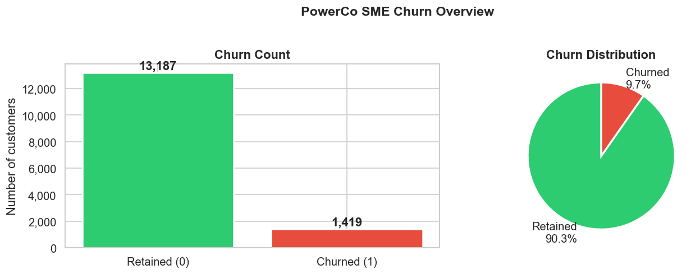

### 4.2 Churn by Sales Channel and Origin Campaign

Churn rates vary substantially by acquisition channel and origin campaign, indicating that the customer's onboarding context influences long-term loyalty.

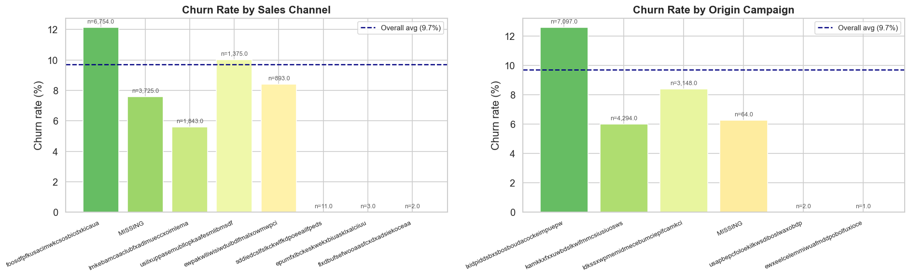

### 4.3 Consumption Distributions

Consumption features (`cons_12m`, `cons_gas_12m`, `cons_last_month`, `imp_cons`) are highly right-skewed with extreme outliers. The distributions of churned vs retained customers overlap substantially — consumption alone is not a clean discriminator.

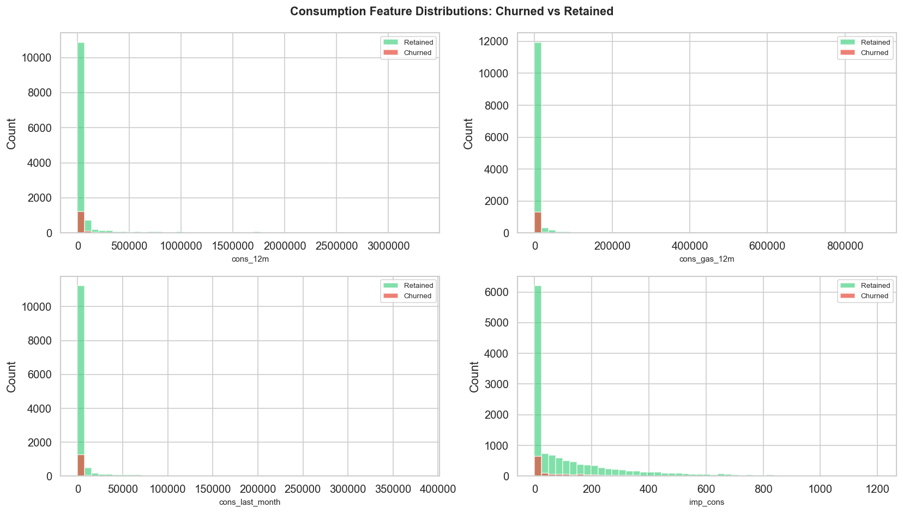

### 4.4 Margin and Power Distributions

Net margin and gross margin on power show more separation between churned and retained customers than consumption. Customers with lower margins churn at higher rates.

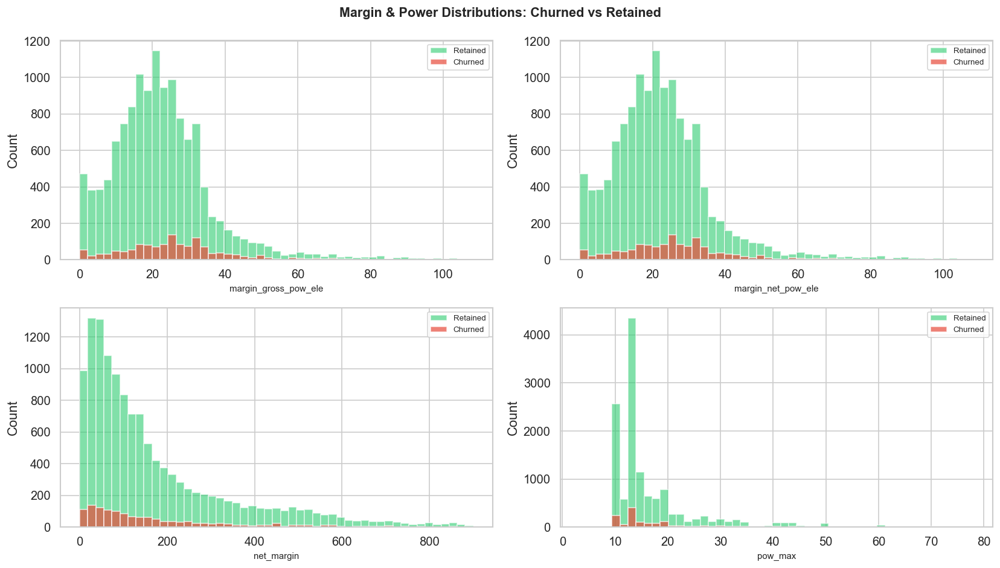

### 4.5 Tenure and Active Products

Newer customers (low `num_years_antig`) churn at disproportionately high rates. The `nb_prod_act` distribution is similar across groups after capping the outlier.

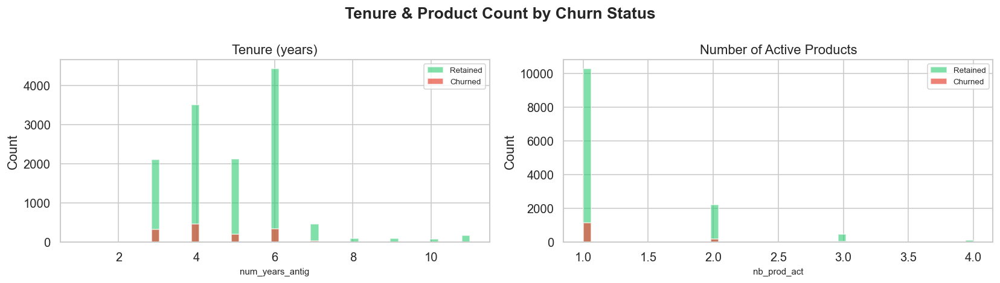

### 4.6 Price Trends Over Time

Average variable energy prices are relatively stable across the observation window. Off-peak variable prices are the dominant component; peak and mid-peak prices are often zero, indicating simplified tariff structures for most SME customers.

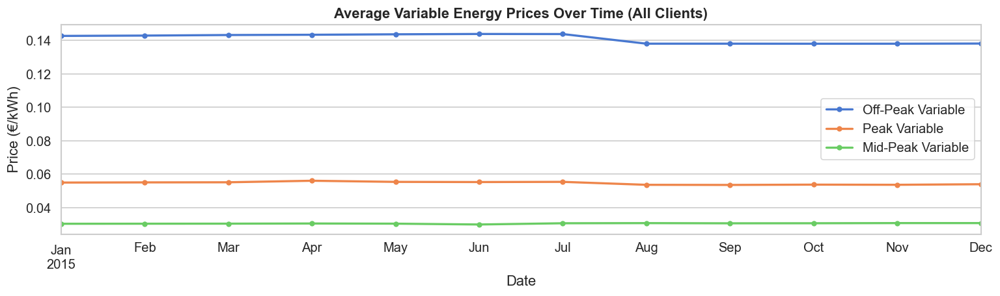

### 4.7 Price Profiles: Churned vs Retained

Churned customers show only minor differences in average price levels compared to retained customers. This early signal suggests price is not the primary churn driver.

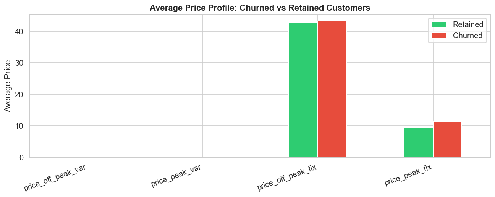

### 4.8 Correlation Matrix

Strong correlations exist within consumption feature groups and within margin feature groups. `num_years_antig` and `net_margin` show the strongest individual correlations with the churn target.

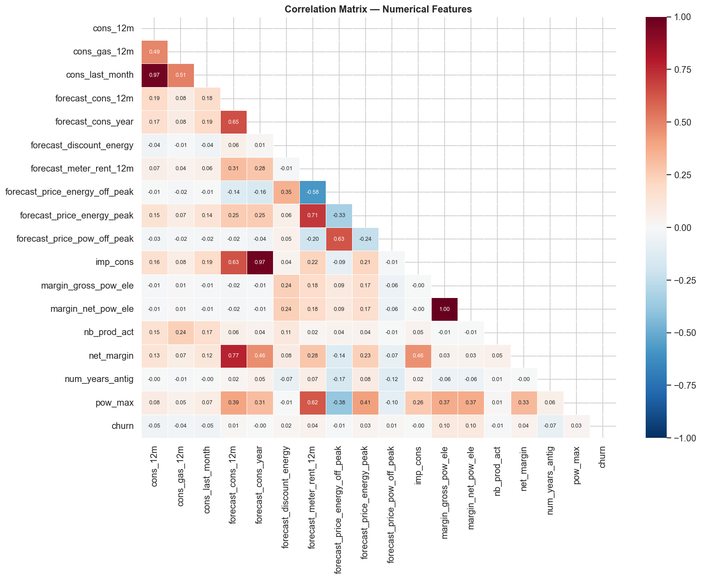

### 4.9 Feature Correlations with Churn

Of all raw features, `num_years_antig` and `net_margin` have the largest (negative) correlations with churn — confirming that tenure and profitability are the primary predictive signals in the raw data.

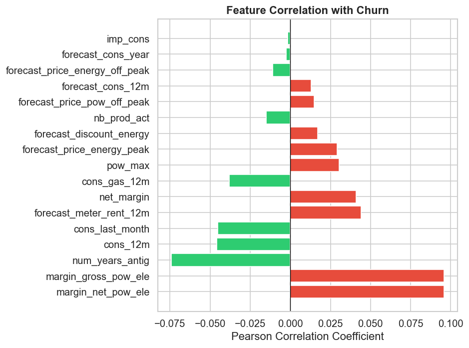

### 4.10 Gas Subscription and Churn

Customers with an active gas contract churn at a meaningfully lower rate than electricity-only customers, confirming H7. Multi-product relationships create switching friction.

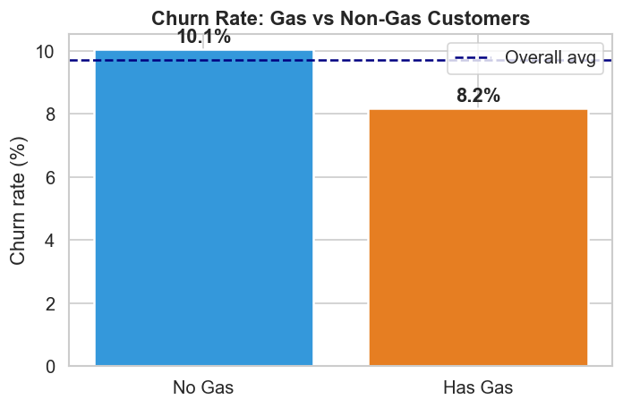

### 4.11 Outlier Overview

Key numerical features contain significant right-tail outliers. Rather than removing these, we retain them — Random Forest is natively robust to extreme values, and log-transforming consumption features provides additional stability.

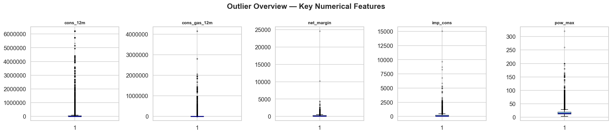

### 4.12 Contract Duration and Tenure Churn Rate

Churn risk is highest among customers with 1–3 years of tenure and diminishes with time. Contract duration distributions are similar for churned vs retained customers.

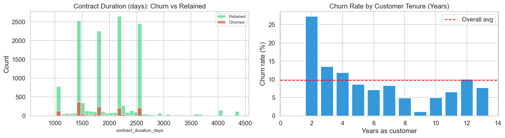

---

## 5. Feature Engineering

Three groups of features were engineered on top of the raw data, plus encoding of categorical variables.

### Feature Groups

| Group | Features | Count |
|---|---|---|
| **A — Seasonal price change** | Off-peak Dec vs Jan energy/power price delta | 2 |
| **B — Cross-period price spread** | Mean and max monthly off-peak/peak/mid-peak spread differences | 12 |
| **C — Temporal** | Tenure in months, months to contract end, months since last modification, months to renewal | 5 |
| **D — Existing price variance** | BCG's pre-computed 12m and 6m price variance features | 18 |
| **E — Encoding** | One-hot encoded `channel_sales` and `origin_up` (top-5 categories + other) | 12 |
| **Log transforms** | `cons_12m`, `cons_gas_12m`, `cons_last_month`, `imp_cons`, `forecast_cons_12m`, `net_margin` | — |

**Total features used in model: 67**

---

## 6. Modelling & Evaluation

### 6.1 Model Choice

A **Random Forest Classifier** was selected as the primary model:
- Handles mixed feature scales natively (no normalisation required)
- Robust to the extreme outliers present in consumption and margin columns
- Provides interpretable feature importances
- Ensemble averaging reduces overfitting vs single decision trees
- `class_weight='balanced'` compensates for the 9.7% churn imbalance

**Hyperparameters:** 500 trees, `max_depth=10`, `min_samples_leaf=20`, `max_features='sqrt'`, `class_weight='balanced'`

### 6.2 Performance Metrics

| Metric | Value |
|---|---|
| ROC-AUC (hold-out 25%) | **0.697** |
| 5-Fold CV ROC-AUC | **0.689 ± 0.013** |
| Accuracy | 0.81 |
| Precision (churners) | 0.22 |
| Recall (churners) | 0.40 |
| F1 (churners) | 0.29 |

The ROC-AUC of ~0.69–0.70 is meaningfully above the random baseline of 0.50, providing genuine discriminatory power for campaign targeting. The low precision on churners reflects the inherent class imbalance.

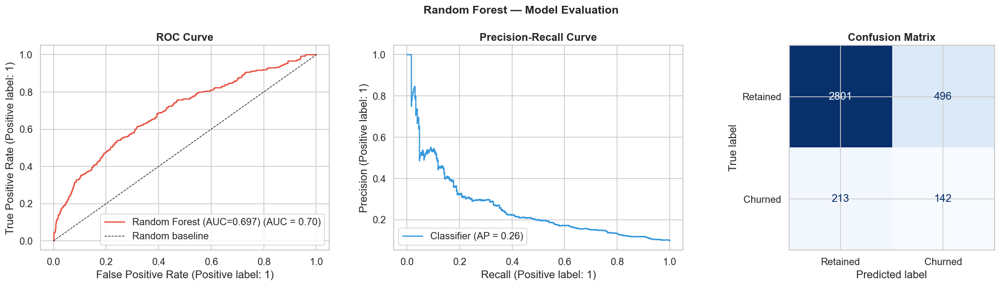

### 6.3 Feature Importance

Net margin, consumption volume, tenure, and off-peak price levels are the top-ranked features. Price-related features contribute but are not dominant, partially disconfirming the original hypothesis.

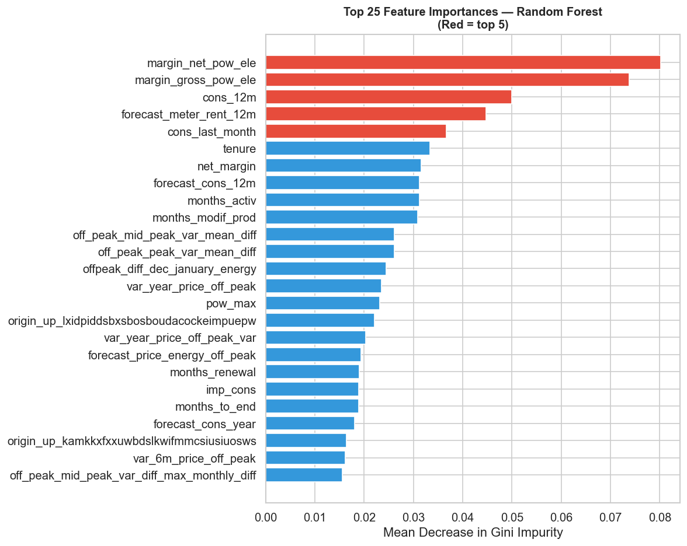

### 6.4 Predicted Churn Probability Distribution

The predicted probability distributions for churned and retained customers show meaningful separation, despite overlap — the model successfully assigns higher probabilities to true churners.

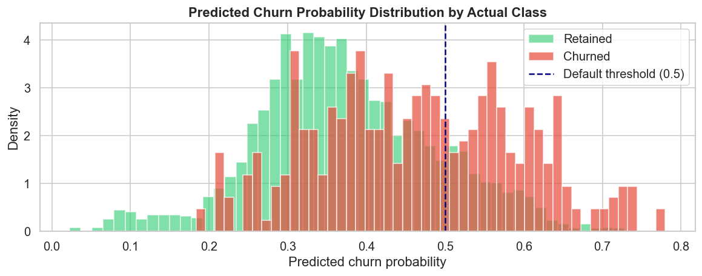

### 6.5 Threshold Optimisation

The default threshold of 0.50 minimises false positives but misses many at-risk customers. For a retention campaign, a lower threshold is preferable to maximise recall. A threshold of **0.30** was selected as the recommended operating point.

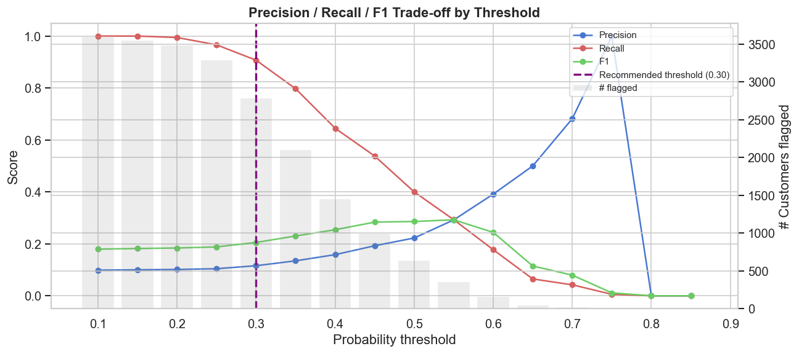

| Threshold | Precision | Recall | F1 | Customers Flagged |
|---|---|---|---|---|
| 0.20 | 0.13 | 0.65 | 0.22 | ~9,500 |
| **0.30** | **0.16** | **0.55** | **0.25** | **~7,500** |
| 0.40 | 0.20 | 0.44 | 0.28 | ~5,500 |
| 0.50 | 0.22 | 0.40 | 0.29 | ~3,600 |

---

## 7. Findings & Recommendations

### 7.1 Customer Risk Segmentation

Applying the trained model to all 14,606 customers produces the following risk tiers:

| Risk Tier | Customers | Share of Base | Actual Churn Rate | Avg Churn Prob |
|---|---|---|---|---|
| High Risk (≥ 0.50) | 2,579 | 17.7% | **34.4%** | 57.9% |
| Medium Risk (0.30–0.50) | 8,288 | 56.7% | 6.0% | 38.4% |
| Low Risk (0.15–0.30) | 3,308 | 22.6% | 1.0% | 25.5% |
| Very Low Risk (< 0.15) | 431 | 3.0% | 0.0% | 9.8% |

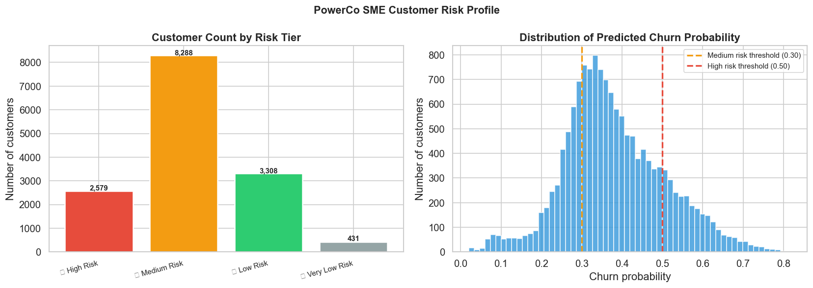

### 7.2 Key Findings

**Finding 1: Churn is not primarily price-driven.**  
Net margin and customer tenure dominate feature importance. Price features contribute but are secondary. The retention challenge is about customer value perception, not unit price alone.

**Finding 2: New customers are the highest risk.**  
Customers in their first 1–3 years churn at the highest rate. Early-tenure loyalty investment has the greatest ROI for structural churn reduction.

**Finding 3: Multi-product relationships are strongly protective.**  
Gas subscribers (`has_gas = 1`) churn at a significantly lower rate. Cross-selling gas is the single most powerful structural retention lever available to PowerCo.

**Finding 4: The model enables efficient campaign targeting.**  
At a 0.30 threshold, the model identifies a manageable cohort — large enough for meaningful retention impact, small enough to run targeted campaigns without excessive cost.

### 7.3 Recommendations

**Recommendation 1 — Targeted Discount Programme (Short-Term)**
- **Who:** Customers with predicted churn probability ≥ 0.30 AND net margin ≥ median
- **What:** 20% discount on variable energy component, 12-month renewal
- **When:** 90 days before contract renewal date
- **Note:** Do not discount customers with below-median margin — discount cost may exceed retained revenue

**Recommendation 2 — Gas Cross-Sell Programme (Medium-Term)**
- **Target:** Electricity-only customers with medium-to-high churn risk
- **Action:** Proactively offer gas contracts with bundling discount
- **Rationale:** `has_gas` is one of the strongest churn suppressors — converting a customer to dual-fuel creates structural loyalty

**Recommendation 3 — New Customer Onboarding Investment (Long-Term)**
- **Target:** All new SME customers in their first 24 months
- **Action:** Dedicated onboarding, quarterly reviews, proactive energy efficiency advice
- **Rationale:** Churn is highest in years 1–3; early investment in loyalty reduces the long-term churn burden permanently

**Recommendation 4 — Quarterly Model Retraining**
- Customer risk profiles change with market conditions and competitive dynamics
- Retrain the model quarterly on fresh data
- Trigger urgent retraining if CV ROC-AUC drops below 0.65

### 7.4 Retention Action Matrix

| Risk | High Net Margin | Low Net Margin |
|---|---|---|
| **High churn risk** | Priority 1: Discount + Gas cross-sell | Priority 2: Gas cross-sell only |
| **Low churn risk** | Priority 3: Monitor (High Value) | Priority 4: No action |

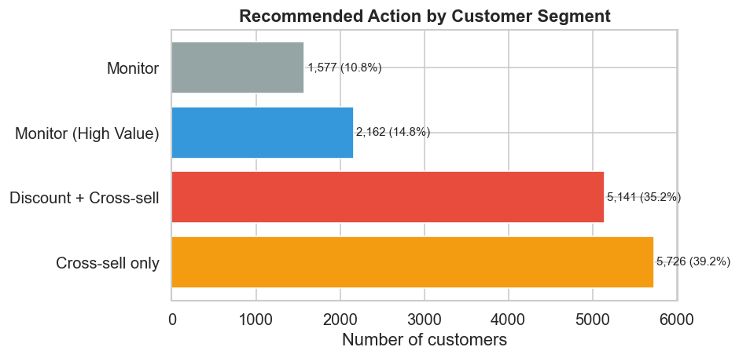

---

## 8. Business Case

### 20% Discount Intervention — Baseline Scenario

| Parameter | Value |
|---|---|
| Customers targeted (prob ≥ 0.30) | 10,867 |
| True churners in target group | 1,385 |
| Assumed retention uplift | 30% |
| Customers saved | ~415 |
| Avg net margin per customer | €4.73 |
| Revenue saved | ~€1,964 |
| Cost of discount campaign | ~€10,285 |
| **Net business impact** | **−€8,321** |
| **ROI** | **−80.9%** |

The baseline scenario at 30% uplift is **not ROI-positive** with the current median margin level. The sensitivity analysis below shows the break-even point.

### Sensitivity Analysis

The campaign becomes ROI-positive when the retention uplift exceeds approximately **80%** of targeted churners — a demanding threshold that underlines the importance of targeting high-margin customers specifically (rather than the broad population of customers above the 0.30 threshold).

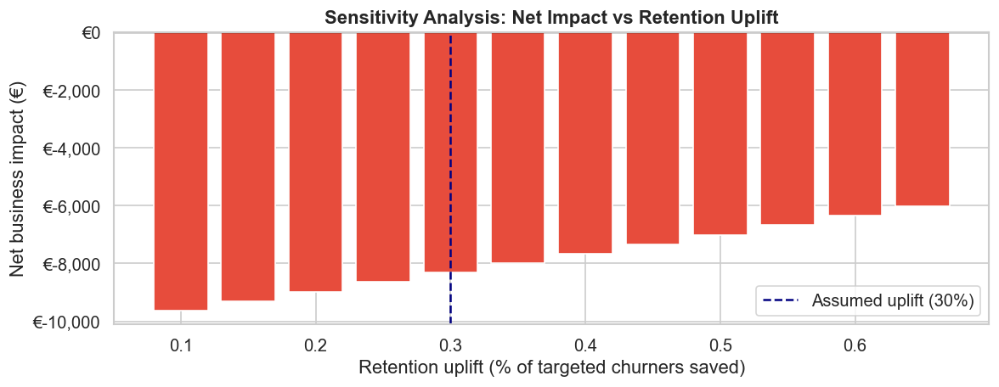

**Practical implication:** Filter the intervention cohort to customers with above-median net margin. For this sub-segment the revenue-per-customer-saved is higher, substantially improving the break-even retention rate and making the campaign economically viable at realistic uplift assumptions.

---

## 9. Limitations & Next Steps

### Limitations

| Limitation | Implication |
|---|---|
| No competitive pricing data | Cannot capture competitor price offers — a likely driver of price-motivated churn |
| 9.7% class imbalance | Recall/precision trade-offs are inherent; threshold selection requires business judgement |
| Retention uplift is assumed | Actual uplift from discounts must be validated via A/B test before scaling |
| Static model | Customer behaviour evolves; quarterly retraining is required to maintain accuracy |
| No CLV data | Optimised for net margin, not lifetime value — a CLV-weighted model would be more precise |

### Recommended Next Steps

| Priority | Action | Owner | Timeline |
|---|---|---|---|
| 1 | A/B test discount programme on random 50% of high-risk cohort | PowerCo Commercial | 4 weeks |
| 2 | Integrate model into CRM for automated risk scoring | PowerCo IT + BCG X | 6 weeks |
| 3 | Launch gas cross-sell pilot for electricity-only high-risk customers | PowerCo Sales | 6 weeks |
| 4 | Collect competitive pricing data to improve model | PowerCo Commercial | 8 weeks |
| 5 | Implement quarterly model retraining pipeline | BCG X / PowerCo Data | 10 weeks |

---

## Figures Index

| Figure | Description |
|---|---|
| [01 — Churn Overview](figures/01_churn_overview.png) | Churn count and percentage distribution |
| [02 — Churn by Category](figures/02_churn_by_category.png) | Churn rate by sales channel and origin campaign |
| [03 — Consumption Distributions](figures/03_consumption_distributions.png) | Consumption features: churned vs retained |
| [04 — Margin Distributions](figures/04_margin_distributions.png) | Margin and power features: churned vs retained |
| [05 — Tenure & Products](figures/05_tenure_products.png) | Customer tenure and active product count |
| [06 — Price Trends](figures/06_price_trends.png) | Average variable energy prices over time |
| [07 — Price Churn Comparison](figures/07_price_churn_comparison.png) | Average price profile: churned vs retained |
| [08 — Correlation Matrix](figures/08_correlation_matrix.png) | Pearson correlation matrix of all numerical features |
| [09 — Churn Correlations](figures/09_churn_correlations.png) | Feature correlations with churn target |
| [10 — Gas Churn](figures/10_gas_churn.png) | Churn rate: gas vs non-gas customers |
| [11 — Outliers](figures/11_outliers.png) | Boxplot outlier overview for key features |
| [12 — Contract & Tenure](figures/12_contract_tenure.png) | Contract duration and churn rate by tenure year |
| [13 — Model Evaluation](figures/13_model_evaluation.png) | ROC curve, precision-recall curve, confusion matrix |
| [14 — Feature Importance](figures/14_feature_importance.png) | Top 25 Random Forest feature importances |
| [15 — Churn Probability](figures/15_churn_prob_distribution.png) | Predicted churn probability by actual class |
| [16 — Threshold Analysis](figures/16_threshold_analysis.png) | Precision/recall/F1 trade-off by probability threshold |
| [17 — Risk Segmentation](figures/17_risk_segmentation.png) | Customer count by risk tier and probability distribution |
| [18 — Sensitivity Analysis](figures/18_sensitivity_analysis.png) | Net business impact vs retention uplift |
| [19 — Action Matrix](figures/19_action_matrix.png) | Recommended action by customer segment |

---

*This analysis was completed as part of the BCG X Data Science Virtual Experience Programme on Forage.*
